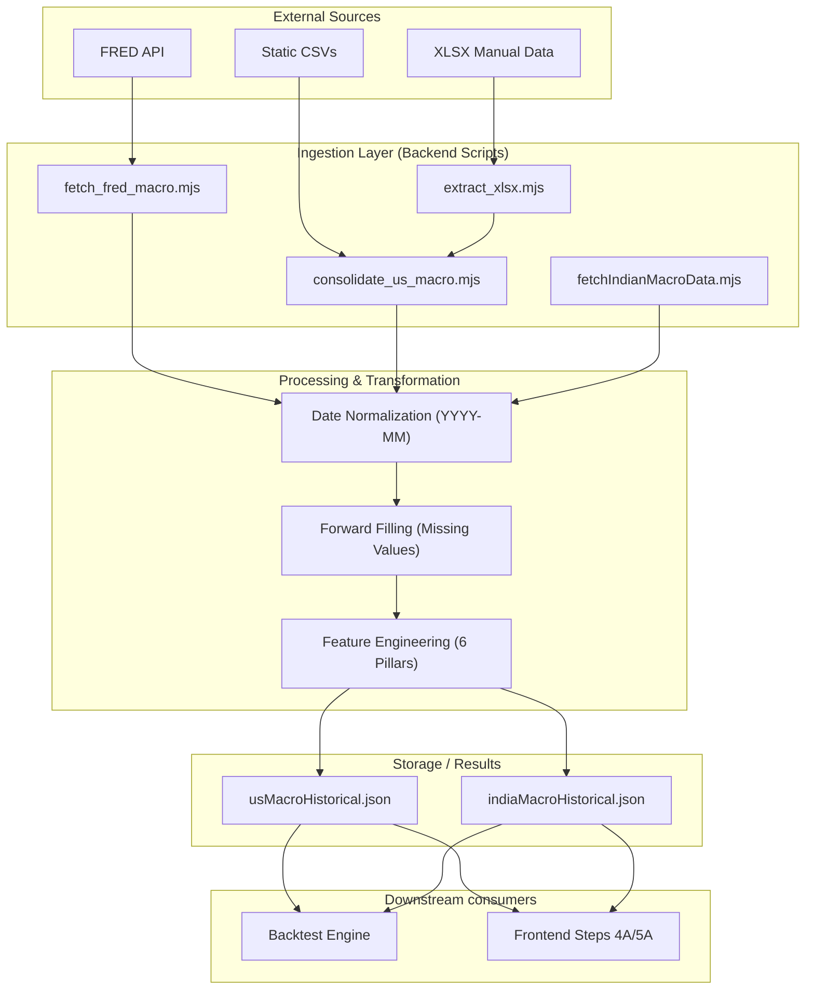

# Data Ingestion Layer Architecture

This document outlines the end-to-end data pipeline for macroeconomic ingestion and normalization within the MFP platform.

## 1. High-Level Data Flow

The ingestion layer is responsible for fetching raw data from multiple sources (API, CSV, XLSX), normalizing date formats, calculating missing pillars (like Inflation Volatility), and consolidating them into unified JSON files for the frontend and backtest engine.

## 2. Ingestion Steps Detail

### Phase 1: Raw Extraction

- **FRED Integration**: Automated fetch for S&P 500, Yields, and Repo rates.
- **XLSX Extraction**: Manual handling of institutional-grade data (Inflation Volatility and Real Policy Rates) using `XLSX` parser.

### Phase 2: Normalization

- **Date Alignment**: All sources (DD/MM/YYYY, YYYY-MM-DD, or Excel Serials) are normalized to an ISO-standard `YYYY-MM` string.
- **Unit Conversion**: Ensuring interest rates are decimals and GDP/Expenses are correctly scaled.

### Phase 3: Pillar Calculation (Feature Engineering)

- **Debt Stress**: Calculated as `(Interest Expense / GDP) * 100`.
- **Inflation Vol**: 6-month rolling standard deviation of YoY PCE/CPI change.
- **Bond-Equity Correlation**: 12-month rolling Pearson correlation proxy.

### Phase 4: Consolidation

- Single source of truth creation (`usMacroHistorical.json`) allowing the frontend to load thousands of data points instantly without API latency.
