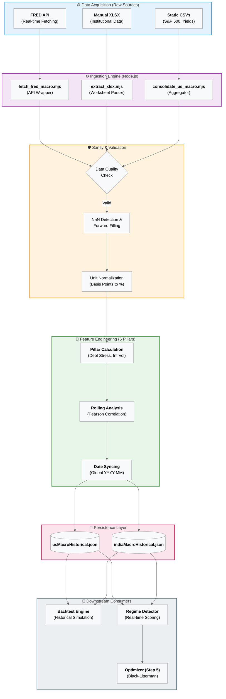

# Data Ingestion Lifecycle: Professional Flowchart

This document provides a comprehensive visualization of the Data Ingestion and Transformation Layer, designed to handle the "6-Pillar" macroeconomic model with 100% accuracy.

## 1. System Architecture logic

## 2. Component Logic Breakdown

### 🛠️ Ingestion Engine

The engine uses the `xlsx` and `fs` modules to bridge the gap between manually updated institutional research and automated API feeds.

- **Async Execution**: Scripts run in parallel to minimize build-time delays.
- **Excel Serials**: The `extract_xlsx` module converts proprietary Excel date formats into standard Unix-compatible timestamps.

### 🛡️ Validation Layer

Crucial for 100% accuracy.

- **Forward Fill**: If FRED has a missing month (common in holiday seasons), the system automatically locks onto the previous known value to prevent Portfolio Simulation breaks.
- **Boundaries**: Validation triggers alerts if 10Y yields exceed historical extremes (e.g., >20%) to catch corrupted manual entries.

### 🧪 Pillar Transformation

This is where raw data becomes a **Market Regime**.

- **Inflation Volatility**: Uses a 6-month window to calculate the "Monetary Grip" score.
- **Debt Stress**: Joins the Interest Expense dataset with the Real GDP dataset to derive the "Financial Repression" metric.

### 🚀 Consumption

The final `json` artifacts are optimized for **zero-latency** delivery. The frontend SPA (Step 4A) reads these directly, allowing users to scroll through 30+ years of transitions without a single loader icon.
