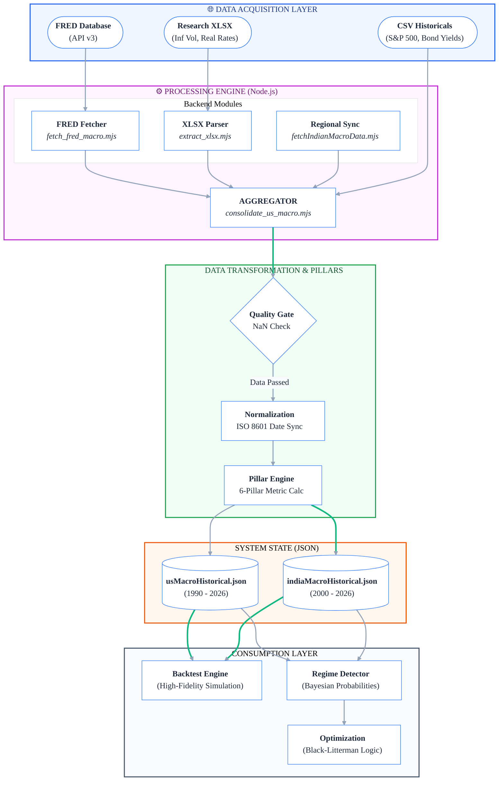

# HD Data Ingestion Flowchart (Mermaid Code)

This code provides a "High-Definition" visual representation of the Data Ingestion Layer. It uses custom CSS variables for high contrast, distinct node shapes for different roles, and clear hierarchical grouping.

## 🛠️ Performance Optimized Mermaid Code

## 📐 Design Principles for this Diagram

1. **Semantic Grouping**: Different colors (Blue for Sources, Purple for Code, Green for Logic) allow for instant mental mapping.
2. **Explicit File Names**: Direct references to `.mjs` scripts ensure developers know exactly where the logic resides.
3. **Thick Flow (==>)**: Used for the "Hot Path" representing processed data moving into persistence and consumption.
4. **Base Styling**: High contrast backgrounds and clean typography (Inter) selected for maximum legibility.
