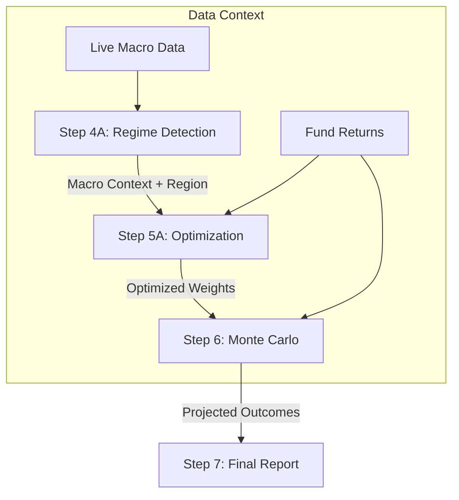

# 🔄 Project Workflow: Regime to Report (End-to-End)

This document outlines the data flow and logic processing from **Step 4A (Regime Detection)** through to the **Step 7 (Final Report)**.

---

## 🏗️ High-Level Pipeline

---

## 1. Step 4A: Regime Detection & Views

**File:** `src/components/Step4ARegimeViews.jsx`

This step establishes the macroeconomic "weather" for the portfolio.

* **Inputs**:
  * `macroData`: Fetched via FRED API (US) or Live Service (India).
  * `selectedRegion`: User selection ('US' or 'IN').
* **Core Logic**:
  * **`detectRegime(macroData)`**: Uses Bayesian probability to classify the economy into one of 6 regimes (e.g., *Inflationary Boom*, *Deflationary Bust*).
  * **`regimeContext`**: A state object created here that persists "Authenticated" details (Risk-Free Rate, Region, Timestamp) for downstream steps.
* **Outputs Passed Forward**:
  * `currentRegime`: The ID of the dominant regime (e.g., `'INFLATIONARY_GROWTH'`).
  * `regimeContext`: The verified macro metadata.

## 2. Step 5A: Regime-Constrained Optimization

**File:** `src/components/Step5ARegimeOptimization.jsx`

This step constructs the optimal portfolio given the constraints of the detected regime.

* **Inputs**: `currentRegime`, `selectedFunds`, `returns`, `regimeContext`.
* **Core Logic**:
  * **Allocation Bands**: Fetches strict min/max weights for asset classes based on the regime (e.g., Gold 10-20% in Inflation).
  * **`optimizeWithRegimeBands()`**:
        1. Aggregates selected funds into Asset Classes.
        2. Calculates optimal weights that satisfying the Regime Bands.
        3. Tilts weights slightly based on individual fund momentum/views.
  * **Constraint Validation**: Ensures no asset class violates the regime's safety rules.
* **Outputs Passed Forward**:
  * `regimeResult`: Object containing `{ weights, expectedReturn, volatility, regime }`.

## 3. Step 6: Probabilistic Simulation (Monte Carlo)

**File:** `src/components/Step6MonteCarlo.jsx`

This step stress-tests the optimized portfolio against thousands of future scenarios.

* **Inputs**: `regimeResult` (Weights), `returns` (Historical Volatility), `regimeContext` (Region).
* **Core Logic**:
  * **Monte Carlo Engine**: Runs 10,000 random walk simulations using the portfolio's expected return and volatility.
  * **Region Awareness**:
    * Checks `regimeContext.detection.region`.
    * Formats output currencies dynamically: **₹ (Lakhs/Crores)** for India, **$ (Millions/k)** for US.
* **Outputs Displayed**:
  * **Fan Chart**: Visualizing 5th, 50th, and 95th percentile paths.
  * **Risk Metrics**: VaR (Value at Risk) and CVaR.

## 4. Step 7: Final Report & Proposal

**File:** `src/components/Step7FinalReport.jsx`

The final dashboard that aggregates all findings into a client-ready presentation.

* **Inputs**: `regimeResult`, `blResult`, `macroData`, `backtestResults`.
* **Core Logic**:
  * **Verification Badge**: Displays "Verified Macro Context" only if `regimeContext` is present.
  * **Comparison**: Tables comparing the Regime Strategy vs. Standard Optimizers (SQP, Critical Line).
  * **Persistence**: clicking "Save to History" uploads the entire state tree to **Supabase** (`allocations` table).
  * **Export**: Generates a detailed PDF/CSV report with all "Authentic" data stamps.

---

## ✅ Key Data Continuity Features

| Feature | Implementation | Verified |
| :--- | :--- | :---: |
| **Authentication** | `regimeContext` is passed from 4A → 7, ensuring the Final Report knows *exactly* which data snapshot was used. | ✅ |
| **Region Awareness** | Currency formatting (₹/$) in Steps 6 & 7 automatically adapts based on Step 4A's selection. | ✅ |
| **Safety Rails** | Step 5A prevents optimization if Regime constraints (e.g., "Must hold Gold") are violated. | ✅ |
